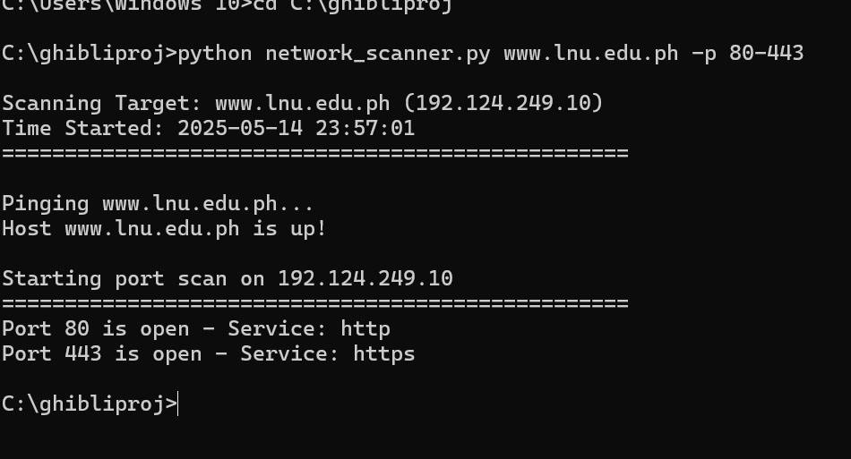

# Network Scanner Tool

A Python-based network reconnaissance tool that combines ping functionality and port scanning capabilities, similar to tools available in penetration testing distributions like Kali Linux. This tool helps identify active hosts and discover open ports that could potentially be entry points into a system.

## Table of Contents
- [Features](#features)
- [Prerequisites](#prerequisites)
- [Installation](#installation)
- [Usage Guide](#usage-guide)
- [Understanding Port Scanning](#understanding-port-scanning)
- [Common Ports and Their Significance](#common-ports-and-their-significance)
- [Security Implications](#security-implications)
- [Legal Disclaimer](#legal-disclaimer)
- [Example Outputs](#example-outputs)
- [Visual Guide](#visual-guide)
- [Troubleshooting Common Issues](#troubleshooting-common-issues)

## Features

- **Host Discovery**: Ping functionality to identify active hosts
- **Port Scanning**: Multi-threaded TCP port scanning
- **Service Identification**: Automatic service detection for open ports
- **Custom Port Ranges**: Flexible port range specification
- **Cross-Platform**: Works on Windows, Linux, and macOS
- **No Dependencies**: Uses Python standard library only

## Prerequisites

- Python 3.x installed on your system
- Basic understanding of networking concepts
- Administrative/root privileges (for some features on Unix-based systems)

## Installation

1. **Clone or Download**
   ```bash
   git clone <your-repository-url>
   # or download the network_scanner.py file directly
   ```

2. **Set Up Python**
   - Windows:
     ```bash
     # Check Python installation
     python --version
     ```
   - Linux/macOS:
     ```bash
     # Make the script executable
     chmod +x network_scanner.py
     ```

3. **Verify Installation**
   ```bash
   python network_scanner.py --help
   ```

## Usage Guide

### Basic Commands

1. **Scan a Single Host**
   ```bash
   python network_scanner.py example.com
   ```

2. **Specify Port Range**
   ```bash
   python network_scanner.py target_host -p 1-100
   ```

3. **Scan Common Web Ports**
   ```bash
   python network_scanner.py target_host -p 80,443
   ```

### Advanced Usage Examples

1. **Scan Local Network Device**
   ```bash
   python network_scanner.py 192.168.1.1
   ```

2. **Comprehensive Web Server Scan**
   ```bash
   python network_scanner.py target_host -p 80-443,8080,8443
   ```

3. **Quick Service Discovery**
   ```bash
   python network_scanner.py target_host -p 21,22,23,25,80,443,3306,5432
   ```

## Understanding Port Scanning

### Port Types and Their Significance

1. **Well-Known Ports (1-1023)**
   - Most privileged services
   - Require root/admin access to bind
   - Commonly targeted in security assessments

2. **Registered Ports (1024-49151)**
   - Used by applications
   - May indicate running services

3. **Dynamic Ports (49152-65535)**
   - Temporary ports
   - Used for client connections

## Common Ports and Their Significance

| Port | Service | Security Implications |
|------|---------|---------------------|
| 21   | FTP     | File transfer, potential anonymous access |
| 22   | SSH     | Secure shell, brute force target |
| 23   | Telnet  | Unencrypted remote access |
| 25   | SMTP    | Email server, spam relay potential |
| 80   | HTTP    | Web server, common entry point |
| 443  | HTTPS   | Secure web server |
| 3306 | MySQL   | Database access |
| 3389 | RDP     | Remote desktop, Windows access |
| 8080 | HTTP Alt| Alternative web server, proxies |

## Security Implications

### Port Scanning as a Security Tool

1. **Reconnaissance**
   - Identifies potential entry points
   - Maps network services
   - Discovers unauthorized services

2. **Common Entry Points**
   - Open ports can be potential "backdoors"
   - Unpatched services may be vulnerable
   - Default configurations might be exploitable

3. **Best Practices for Protection**
   - Close unnecessary ports
   - Use firewalls
   - Keep services updated
   - Monitor for scanning activity

### Defensive Measures

1. **For System Administrators**
   - Regular port audits
   - Implement port knocking
   - Use intrusion detection systems (IDS)
   - Configure proper firewall rules

2. **For Developers**
   - Implement rate limiting
   - Use secure defaults
   - Monitor access logs
   - Implement proper authentication

## Legal Disclaimer

This tool is provided for educational and authorized testing purposes only. Unauthorized port scanning may be illegal in many jurisdictions and can be considered a precursor to cyber attacks. Always:

1. Obtain explicit permission before scanning any systems
2. Follow your organization's security policies
3. Comply with all applicable laws and regulations
4. Document your testing activities
5. Report security issues responsibly

## License

This tool is provided under the MIT License. Use at your own risk.

## Contributing

Feel free to submit pull requests, report bugs, or suggest features.

## Author's Note

Remember that port scanning is often the first step in both security assessments and cyber attacks. Use this tool responsibly and only on systems you own or have explicit permission to test. Understanding open ports and services is crucial for:

- Network security assessments
- System hardening
- Vulnerability management
- Compliance checking
- Security architecture planning

However, this knowledge comes with responsibility. Always use security tools ethically and legally.

## Example Outputs

### 1. Basic Port Scan Output
```bash
$ python network_scanner.py example.com -p 80-443

Scanning Target: example.com (93.184.216.34)
Time Started: 2024-03-20 10:30:15
==================================================

Pinging example.com...
Host example.com is up!

Starting port scan on 93.184.216.34
==================================================
Port 80 is open - Service: http
Port 443 is open - Service: https
```

### 2. Comprehensive Service Discovery
```bash
$ python network_scanner.py localhost -p 1-100

Scanning Target: localhost (127.0.0.1)
Time Started: 2024-03-20 10:35:22
==================================================

Pinging localhost...
Host localhost is up!

Starting port scan on 127.0.0.1
==================================================
Port 21 is open - Service: ftp
Port 22 is open - Service: ssh
Port 80 is open - Service: http
Port 3306 is open - Service: mysql
```

### 3. Failed Scan Example
```bash
$ python network_scanner.py nonexistent.domain

Hostname could not be resolved
```

## Visual Guide

### Tool Interface and Results


*Figure 1: Example of a port scanning process in action*


*Figure 2: Sample output showing discovered open ports and services*

### Understanding the Results


*Figure 3: Analysis of different port states and their meanings*

To add your own screenshots:

1. Save your screenshots in the `screenshots` directory with these names:
   ```
   screenshots/
   ├── port_scan_process.png
   ├── scan_results.png
   └── port_analysis.png
   ```

2. Recommended screenshot contents:
   - `port_scan_process.png`: Capture the tool while it's running a scan
   - `scan_results.png`: Show a successful scan with multiple open ports
   - `port_analysis.png`: Include a diagram or example of different port states

3. Image requirements:
   - Format: PNG or JPG
   - Resolution: At least 1280x720
   - Size: Keep under 500KB per image
   - Content: Ensure no sensitive information is visible

## Troubleshooting Common Issues

### Common Error Messages

1. "Hostname could not be resolved"
   - Check internet connection
   - Verify the hostname is correct
   - Try using IP address instead

2. "Permission denied"
   - Run the script with administrator/root privileges
   - Check firewall settings
   - Verify you have permission to scan the target

3. "Connection timed out"
   - Target might be blocking ICMP/ping requests
   - Try increasing the timeout value
   - Check network connectivity

### Performance Tips

1. For faster scans:
   - Limit port ranges to commonly used ports
   - Use specific port lists instead of ranges
   - Scan local network hosts first

2. For more accurate results:
   - Run multiple scans
   - Verify results with different tools
   - Document false positives

Remember that port scanning is often the first step in both security assessments and cyber attacks. Use this tool responsibly and only on systems you own or have explicit permission to test. Understanding open ports and services is crucial for:

- Network security assessments
- System hardening
- Vulnerability management
- Compliance checking
- Security architecture planning

However, this knowledge comes with responsibility. Always use security tools ethically and legally.

## Example Output

Here's an example of scanning a website for common web ports:


*Example output showing the results of scanning a website's ports*

